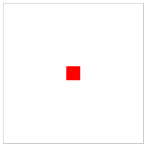
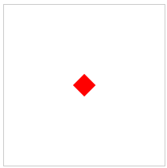
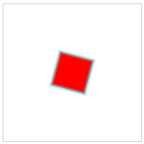
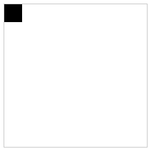
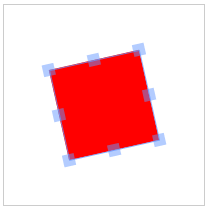
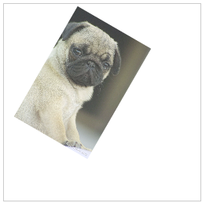
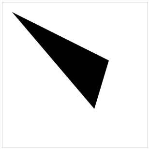
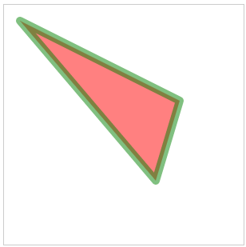
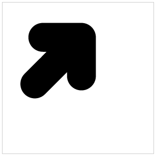

# Fabric.js简介第1部分


今天，我想向您介绍Fabric.js，一个强大的Javascript库，使canvas的使用变得轻而易举.Fabric为canvas提供了一个缺失的`Object`模型，以及一个 SVG 解析器，交互层和一整套其他不可或缺的工具.这是一个完全开源的项目，在麻省理工学院获得许可，多年来做出了许多贡献。

## 为什么选择fabric

如今，canvas让我们能够在网络上创建一些令人叹为观止的图形。但它提供的 API 却非常低级，令人失望。如果我们只是想在canvas上绘制几个基本图形，然后就不管它们了，那是一回事。但一旦需要进行任何形式的交互，在任何位置更改图片或绘制更复杂的图形，情况就会发生巨大的变化。

fabirc.js旨在解决这一问题。

本地canvas方法只允许我们执行简单的图形命令，盲目修改整个canvas位图。想画一个矩形？使用 `fillRect(left， top， width， height)`。想要绘制直线？使用 `moveTo(left， top)` 和 `lineTo(x， y)` 的组合。这就好比我们用画笔在canvas上涂抹油彩，油彩越涂越多，却几乎无法控制。

Fabric 在本地方法的基础上提供了简单但功能强大的`Object`模型，而不是在如此低的级别上进行操作。它负责canvas状态和渲染，让我们可以直接与 "`Object` "打交道。

让我们看一个简单的示例来说明这种差异。假设我们想在canvas上某处绘制一个红色矩形。下面是我们使用本地 canvas API 的方法。
```javascript
var canvasEl = document.getElementById('c');
var ctx = canvasEl.getContext('2d');
ctx.fillStyle = 'red';
ctx.fillRect(100， 100， 20， 20);
```
现在，让我们看看如何使用 Fabric 进行同样的操作：
```javascript
var canvas = new fabric.Canvas('c');
var rect = new fabric.Rect({
  left: 100，
  top: 100，
  fill: 'red'，
  width: 20，
  height: 20
});
canvas.add(rect);
```


在这一点上，大小几乎没有差别，两个示例非常相似。不过，您已经可以看出使用canvas的方法有多么不同。使用原生方法时，是对**上下文**（代表整个canvas位图的`Object`）进行操作。在 Fabric 中，我们对`Object`进行操作**实例化`Object`**，更改其属性并将其添加到canvas。您可以看到，这些`Object`在 Fabric 中是一等公民。
但呈现纯红色矩形实在是太无聊了。我们至少可以用它做些有趣的事情！或许，稍微旋转一下？

让我们试试 45 度旋转。首先，使用本地 canvas方法：
```javascript
var canvasEl = document.getElementById('c');
var ctx = canvasEl.getContext('2d');
ctx.fillStyle = 'red';

ctx.translate(100， 100);
ctx.rotate(Math.PI / 180 * 45);
ctx.fillRect(-10， -10， 20， 20);
```
现在使用fabric：
```javascript
var canvas = new fabric.Canvas('c');
var rect = new fabric.Rect({
  left: 100，
  top: 100，
  fill: 'red'，
  width: 20，
  height: 20，
  angle: 45
});
canvas.add(rect);
```


这里发生了什么？

在Fabric中，我们只需将`Object`的角度值改为45。然而，用canvas方法，事情就变得更有趣了。请记住，我们不能对`Object`进行操作。相反，我们可以调整整个`Canvas`位图的定位和角度（`ctx.translate，ctx.rotate`），以满足我们的需要。然后，我们再次绘制矩形，但要记住适当偏移位图（-10，-10），使其仍然呈现在 100，100 点上。此外我们还必须在旋转`Canvas`位图时将度数转换为弧度。
我相信你已经开始明白Fabric存在的原因，以及它封装了多少canvas底层代码。
不过，让我们来看另一个例子 跟踪`Canvas`状态。

如果，我们想将现在熟悉的红色矩形移动到`Canvas`上稍有不同的位置，该怎么办？在无法对`Object`进行操作的情况下，我们该怎么做呢？我们会在`Canvas`位图上调用另一个 fillRect吗？
不尽然。调用另一个fillRect命令实际上是在`Canvas`上已绘制的矩形上再绘制一个矩形。还记得我之前提到用画笔作画吗？为了移动它，我们需要先擦除之前绘制的内容，然后在新的位置绘制矩形。
```javascript
var canvasEl = document.getElementById('c');
...
ctx.strokRect(100， 100， 20， 20);
...
//清空所有内容
ctx.clearRect(0， 0， canvasEl.width， canvasEl.height);
ctx.fillRect(20， 50， 20， 20);
```
我们如何通过fabric来实现这个目标呢？
```javascript
var canvas = new fabric.Canvas('c');
...
canvas.add(rect);
...
rect.set({ left: 20， top: 50 });
canvas.renderAll();
```


请注意一个非常重要的区别.有了Fabric，在尝试修改任何内容之前，我们不再需要擦除内容。我们仍然可以处理`Object`，只需更改其属性，然后重新渲染`Canvas`即可获得全新的画面。

## `Object`
我们已经了解了如何通过实例化fabric.Rect构造函数来处理矩形.当然，Fabric还包括所有其他基本形状，如圆形，三角形，椭圆形等。所有这些图形都在Fabric命名空间中以 fabric.Circle，fabric.Triangle，fabric.Ellipse 等形式公开。

fabric中提供 7 种基本形状：
* [fabric.Circle](../object/Circle/index.md)
* [fabric.Ellipse](../object/Circle/index.md)
* [fabric.Line](../object/Circle/index.md)
* [fabric.circle](../object/Circle/index.md)
* [fabric.Polygon](../object/Circle/index.md)
* [fabric.Polyline](../object/Circle/index.md)
* [fabric.Rect](../object/Circle/index.md)
* [fabric.Triangle](../object/Circle/index.md)

想要画一个圆？只需创建一个圆形`Object`，并将其添加到`Canvas`上。其他基本形状也一样：
```javascript
var circle = new fabric.Circle({
  radius: 20， fill: 'green'， left: 100， top: 100
});
var triangle = new fabric.Triangle({
  width: 20， height: 30， fill: 'blue'， left: 50， top: 50
});

canvas.add(circle， triangle);

```
这样我们在 100，100 位置画了一个绿色圆圈，在 50，50 位置画了一个蓝色三角形。

## 操作`Object`
创建矩形，圆形或其他图形`Object`当然只是一个开始。在某些时候，我们可能会想要修改这些`Object`。也许某些操作需要触发状态变化，或者播放某种动画。或者，我们可能想通过某些鼠标交互来改变`Object`属性（颜色，不透明度，大小，位置）。

Fabric 会为我们处理`Canvas`渲染和状态管理.我们只需要修改`Object`本身。

前面的示例演示了set方法，以及调用 `set({ left: 20， top: 50 })` 如何将`Object`从之前的位置 "移动"。同样，我们也可以更改`Object`的其他属性。但这些属性是什么呢？

正如你所想的，他们包含定位**left，top**; 尺寸**width，height**; 渲染 **fill， opacity， stroke， strokeWidth**;  缩放和旋转**scaleX，scaleY，angle**; 甚至还有与翻转相关的属性**flipX，flipY** 和倾斜 **skewX，skewY**。

是的，在Fabric中创建翻转`Object`就像将`flip*`属性设置为`true`一样简单.

你可以通过`get`方法读取任何这些属性，也可以通过`set`方法设置它们。让我们尝试更改红色矩形的一些属性：
```javascript
var canvas = new fabric.Canvas('c');
...
canvas.add(rect);

rect.set('fill'， 'red');
rect.set({ strokeWidth: 5， stroke: 'rgba(100，200，200，0.5)' });
rect.set('angle'， 15).set('flipY'， true);
```


首先，我们将`fill`值设置为`red`，从而使`Object`呈现红色.下一条语句同时设置`strokeWidth`和`stroke`值，使矩形具有5px的淡绿色描边.最后，我们要改变`angle`和`flipY`属性。请注意，这3条语句使用的语法略有不同。
这说明`set`是一种通用方法。你可能会经常用到它，所以要尽可能方便。
我们已经介绍了`setter`，那么`getter`呢？很明显，有对应的get方法，也有一些特定的`get*`方法。要读取`Object`的宽度值，可以使用`get('width')`或`getWidth()`。要获取`scaleX`值`get('scaleX')`或`getScaleX()`等等。每个"公共"`Object`属性（`stroke`，`strokeWidth`，`angle`等）都有一个类似`getWidth`或`getScaleX`的方法。

你可能会注意到，在之前的示例中，创建`Object`时使用的配置哈希值与我们刚刚在`set`方法中使用的配置哈希值相同。这是因为它们**完全相同**.你可以在创建`Object`时配置`Object`，也可以在创建后使用`set`方法：
```javascript
var rect = new fabric.Rect({ width: 10， height: 20， fill: '#f55'， opacity: 0.7 });
// 函数式形式
var rect = new fabric.Rect();
rect.set({ width: 10， height: 20， fill: '#f55'， opacity: 0.7 });
```
### 默认选项
这时，你可能会问如果我们在创建`Object`时没有传递任何参数，会发生什么情况？它还具有这些属性吗？

当然有。Fabric中的`Object`总是有一组默认属性。如果在创建过程中省略了这些属性，那么"赋予"`Object`的就是这组默认属性。我们可以自己试试看：
```javascript
var rect = new fabric.Rect(); // 无参数

rect.get('width'); // 0
rect.get('height'); // 0

rect.get('left'); // 0
rect.get('top'); // 0

rect.get('fill'); // rgb(0，0，0)
rect.get('stroke'); // null

rect.get('opacity'); // 1
```
我们的矩形有一组默认属性。它的位置为 0，0，颜色为黑色，完全不透明，没有描边，也没有尺寸（宽度和高度均为 0）。由于没有尺寸，我们无法在`Canvas`上看到它。但是，如果给它的宽度/高度设置任何正值，它肯定会在`Canvas`的左上角显示出一个黑色矩形。


### 等级与继承
fabric`Object`并不是独立存在的。它们形成了一个非常精确的层次结构。
大多数`Object`都继承自一个根`fabric.Object`。`fabric.Object`类似于一个二维形状，它被放置在二维`Canvas`平面中。它是一个具有`top/left`和`width/height`属性以及一系列其他图形特征的实体。我们在`Object`上看到的fill， stroke， angle， opacity， flip*等属性，都是继承自 `fabric.Object`。

这种继承性允许我们在`fabric.Object`上定义方法，并在所有子**类**中共享。例如，如果您想在所有`Object`上都使用`getAngleInRadians`方法，只需在`fabric.Object.prototype`上创建即可：
```javascript
fabric.Object.prototype.getAngleInRadians = function() {
  return this.get('angle') / 180 * Math.PI;
};

var rect = new fabric.Rect({ angle: 45 });
rect.getAngleInRadians(); // 0.785...

var circle = new fabric.Circle({ angle: 30， radius: 10 });
circle.getAngleInRadians(); // 0.523...

circle instanceof fabric.Circle; // true
circle instanceof fabric.Object; // true
```
如您所见，方法立即在所有实例上可用。
虽然子"类"继承自`fabric.Object`，但它们通常也会定义自己的方法和属性。例如，`fabric.Circle`需要有"半径"属性。而我们稍后将讨论的`fabric.Image`类则需要有`getElement/setElement`方法
在高级项目中，使用原型`prototypes`获得自定义渲染和行为是非常常见的。

## Canvas
既然我们已经详细介绍了`Object`，现在让我们回到`Canvas`。

在所有Fabric示例中，您首先可以看到`canvas object`的创建(`newfabric.Canvas('...')`)。`fabric.Canvas`充当`canvas`元素的包装器，负责管理该特定`Canvas`上的所有`canvas object`。它接收元素的id，并返回fabric.Canvas实例。

我们可以在其中添加`Object`，引用`Object`或删除`Object`
```javascript
var canvas = new fabric.Canvas('c');
var rect = new fabric.Rect();

canvas.add(rect); // 添加 object

canvas.item(0); // 最近添加的 object
canvas.getObjects(); // 获取所有object (rect会是第一个也是唯一一个)

canvas.remove(rect); // 删除object
```
虽然管理`object`是`fabric.Canvas`的主要目的，但它同时也是一个`配置主机`。需要为整个画布设置背景颜色或图像？将所有内容剪切到特定区域？设置不同的width/height？指定画布是否是交互式的？所有这些选项（以及其他选项）都可以在创建时或创建后在`fabric.Canvas`上进行设置：
```javascript
var canvas = new fabric.Canvas('c'， {
  backgroundColor: 'rgb(100，100，200)'，
  selectionColor: 'blue'，
  selectionLineWidth: 2
  // ...
});

// or

var canvas = new fabric.Canvas('c');
canvas.setBackgroundImage('http://...');
canvas.onFpsUpdate = function(){ /* ... */ };
// ...
```
### 交互
既然谈到了画布元素，我们就来谈谈交互性。Fabric的独特功能之一（直接内置）就是在我们刚刚看到的便捷Object模型之上添加一层交互性。

Object模型允许以编程方式访问和操作画布上的Object。但在外部，在用户层面，可以通过鼠标（或触摸设备上的触摸）来操作这些Object。只要通过`new fabric.Canvas('...')`对画布进行初始化，就可以选择Object、拖动Object、缩放或旋转Object，甚至可以将Object组合在一起进行操作！
 
如果我们希望用户允许在画布上拖动某些东西（比如说图像），我们只需初始化画布并在其上添加一个Object即可。无需额外的配置或设置。

为了控制这种交互性，我们可以在画布上使用Fabric的`selection`布尔属性，并结合单个Object的`selection`布尔属性。
```javascript
var canvas = new fabric.Canvas('c');
...
canvas.selection = false; // 关闭组选择
rect.set('selectable', false); // 使object不可选中
```
但如果您根本不需要这样的交互层呢？如果是这种情况，您可以用`fabric.StaticCanvas`代替`fabric.Canvas`。初始化的语法完全相同，只是使用了`StaticCanvas`而不是`Canvas`。
```javascript
var staticCanvas = new fabric.StaticCanvas('c');

staticCanvas.add(
  new fabric.Rect({
    width: 10, height: 20,
    left: 100, top: 100,
    fill: 'yellow',
    angle: 30
  }));
  ```
这样就创建了一个"轻量级"的画布版本，不需要任何事件处理逻辑。请注意，您仍然可以使用整个Object模型--添加Object、删除或修改Object，以及更改画布的任何配置--所有这些仍然有效。只是没有了事件处理功能。

稍后，当我们介绍自定义构建选项时，您会发现如果您只需要`StaticCanvas`，您甚至可以创建一个更轻量级的Fabric版本。如果您需要在应用程序中使用非交互式图表或带有过滤器的非交互式图像，这将是一个不错的选择。
```html
<canvas id="c"></canvas>

```
```javascript
var canvas = new fabric.Canvas('c');
var imgElement = document.getElementById('my-image');
var imgInstance = new fabric.Image(imgElement, {
  left: 100,
  top: 100,
  angle: 30,
  opacity: 0.85
});
canvas.add(imgInstance);
```
请注意我们是如何向`fabric.Image`构造函数传递图像元素的。这会创建一个`Fabric.Image`实例，它看起来就像文档中的图片一样。此外，我们立即将left/top值设置为100/100，角度设置为30，不透明度设置为0.85。添加到画布后，图像将以100,100的位置、30度的角度呈现，并且略微透明！还不错。



如果我们没有一个图片dom，只有一个Url怎么办。没问题，让我们看看如何使用`fabric.Image.fromURL`：
```javascript
fabric.Image.fromURL('my_image.png', function(oImg) {
  canvas.add(oImg);
});
```
看起来很简单，不是吗？只需使用图片的 URL 调用 `fabric.Image.fromURL`，并在图片加载和创建完成后给它一个回调函数。回调函数的第一个参数是已创建的 `fabric.Image` 对象。此时，您可以将其添加到画布，或者先进行更改，然后再添加到画布：
```javascript
fabric.Image.fromURL('my_image.png', function(oImg) {
  // scale image down, and flip it, before adding it onto canvas
  oImg.scale(0.5).set('flipX', true);
  canvas.add(oImg);
});
```
### Paths
我们先看了简单的形状，然后是图像。那么更复杂、更丰富的形状和内容呢？

来认识一下这对 "强强联手"--路径和群组。

Fabric 中的路径表示形状的轮廓，可以填充、描画和以其他方式修改。路径由一系列命令组成，本质上是模仿笔从一点到另一点的过程。借助 "移动"、"直线"、"曲线 "或 "弧线 "等命令，路径可以形成极其复杂的形状。借助路径组（`PathGroup's`），路径将拥有更丰富的可能性。

Fabric 中的路径与 `SVG <path>` 元素非常相似。它们使用相同的命令集，可以从 `<path>` 元素创建，也可以序列化到 `<path>` 元素中。我们稍后会更详细地介绍序列化和 SVG 解析，但现在值得一提的是，你可能很少会手动创建路径实例。相反，您会使用 Fabric 内置的 SVG 解析器。为了了解什么是路径对象，让我们尝试手动创建一个简单的路径对象：
```javascript
var canvas = new fabric.Canvas('c');
var path = new fabric.Path('M 0 0 L 200 100 L 170 200 z');
path.set({ left: 120, top: 120 });
canvas.add(path);
```


我们正在实例化 `fabric.Path` 对象，并将一串路径指令传递给它。虽然看起来很神秘，但其实很容易理解。M代表`move`指令，告诉隐形笔移动到0，0点。L代表 `line`，让钢笔画一条线到200，100点。然后，另一个L会在170、200点之间画一条线。最后，Z会强制绘图笔关闭当前路径并最终确定形状。这样，我们就得到了一个三角形。

由于 `fabric.Path`与Fabric中的其他对象一样，我们也可以更改它的一些属性。但我们还可以对其进行更多修改：
```javascript
...
var path = new fabric.Path('M 0 0 L 300 100 L 200 300 z');
...
path.set({ fill: 'red', stroke: 'green', opacity: 0.5 });
canvas.add(path);
```


出于好奇，让我们来看看稍微复杂一些的路径语法。你会明白为什么手工创建路径可能不是最好的办法。

```javascript
...
var path = new fabric.Path('M121.32,0L44.58,0C36.67,0,29.5,3.22,24.31,8.41\
c-5.19,5.19-8.41,12.37-8.41,20.28c0,15.82,12.87,28.69,28.69,28.69c0,0,4.4,\
0,7.48,0C36.66,72.78,8.4,101.04,8.4,101.04C2.98,106.45,0,113.66,0,121.32\
c0,7.66,2.98,14.87,8.4,20.29l0,0c5.42,5.42,12.62,8.4,20.28,8.4c7.66,0,14.87\
-2.98,20.29-8.4c0,0,28.26-28.25,43.66-43.66c0,3.08,0,7.48,0,7.48c0,15.82,\
12.87,28.69,28.69,28.69c7.66,0,14.87-2.99,20.29-8.4c5.42-5.42,8.4-12.62,8.4\
-20.28l0-76.74c0-7.66-2.98-14.87-8.4-20.29C136.19,2.98,128.98,0,121.32,0z');

canvas.add(path.set({ left: 100, top: 200 }));
```
什么情况？

嗯，M仍然代表`move`命令，因此钢笔从"121.32，0"点开始它的绘图之旅。然后是L命令，把它带到"44.58，0"点。到目前为止一切顺利。接下来呢？C命令，代表`cubic bezier`。它使钢笔绘制从当前点到"36.67，0"点的贝塞尔曲线。它将"29.5,3.22 "作为线首的控制点，将"24.31,8.41"作为线尾的控制点。之后又执行了十几条其他立方体贝塞尔曲线命令，最终形成了一个漂亮的箭头形状。



您很可能不会直接使用这些"野兽"。相反，您可能希望使用类似`fabric.loadSVGFromString`或`fabric.loadSVGFromURL`这样的方法来加载整个SVG文件，然后让 Fabric的SVG分析器来处理所有SVG元素并创建相应的Path对象。

说到整个SVG文档，Fabric的Path通常表示 `SVG path` 元素，而SVG文档中经常出现的路径集合则表示为`Group（fabric.Group 实例）`。可以想象，Group就是一组路径和其他对象。由于`fabric.Group`继承自`fabric.Object`，因此它可以像其他对象一样添加到画布中，并以相同的方式进行操作。

与路径一样，您可能不会直接使用它们。但如果您在解析SVG文档时偶然发现了它们，您就会清楚地知道它们是什么，有什么用途。

# Fabric.js简介第2部分