# Fabric.js简介第2部分
在本系列的第一部分中，我们刚刚开始熟悉 Fabric.js。我们了解了使用 Fabric 的原因、其object模型和object层次结构，以及 Fabric 中的各种实体（简单形状、图像和复杂路径）。我们还学习了如何在canvas上对 Fabric object执行简单操作。

现在，大部分基础知识已经介绍完毕，让我们开始一些有趣的内容！

## 动画

任何值得尊敬的canvas库都离不开动画功能。Fabric也不例外。既然Fabric有如此强大的object模型和图形功能，不内置动画辅助工具就太可惜了。

还记得改变任何object的属性有多简单吗？我们只需调用set方法并传递相应的值即可：
```javascript
rect.set('angle', 45);
```
那么，动画object也同样简单。每个Fabricobject都有`animate`方法可以使object产生动画。
```javascript
rect.animate('angle', 45, {
  onChange: canvas.renderAll.bind(canvas)
});
```
第一个参数是要制作动画的属性。第二个参数是动画的结束值。如果矩形的角度为-15°，而我们传递的是45°，那么它将从-15°变成45°。第三个参数是一个可选object，用于指定更精细的动画细节`duration`, `callbacks`, `easing`,等。

animate 的一个方便之处在于它还支持相对值。例如，如果您想将object的左属性动画化 100px，可以这样做：
```javascript
rect.animate('left', '+=100', { onChange: canvas.renderAll.bind(canvas) });
```
同样的 角度也可以
```javascript
rect.animate('angle', '-=5', { onChange: canvas.renderAll.bind(canvas) });
```
你可能想知道为什么我们总是在这里指定 "onChange "回调。第三个参数不是可选的吗？是的，但是在每个动画帧上调用 canvas.renderAll 才能让我们看到实际的动画效果！要知道，当我们调用 animate 方法时，它只会按照特定的算法在一段时间内对**属性值**进行动画处理。因此，`rect.animate('angle', 45)` 只改变object的角度，但**不会在每次改变角度后重新渲染canvas屏幕**。而我们显然需要重新渲染才能看到实际的动画效果。

请记住，canvas表面下有整个object模型。object有自己的属性和关系，canvas只负责将它们的存在投射到外部世界。

animate 不会在每次更改后自动重新渲染canvas，这是出于性能考虑。毕竟，canvas上可能有成百上千的动画object，如果每个object都要重新渲染屏幕，那就不太好了。在object较多的情况下，您可以使用 `requestAnimationFrame`（或其他基于定时器的）循环来自行连续渲染canvas，而无需为每个object调用 `renderAll`。但大多数情况下，您可能需要明确指定 canvas.renderAll 作为 "onChange "回调。

那么，我们还可以向动画传递哪些选项呢？

* `from`：允许指定可动画属性的起始值（如果我们不想使用当前值）。
* `duration`：默认为 500（毫秒）。可用于更改动画的持续时间。
* `onComplete`：完成时动画结束时调用的回调。
* `easing`：缓和函数：缓和函数。
所有这些选项应该都不言自明，除了 easing 功能。让我们仔细看看。

默认情况下，animate 使用`easeInSine`函数制作动画。如果这不是你所需要的，在 `fabric.util.ease` 下有大量的`ease`选项。例如，如果我们想以弹跳的方式将object向右移动，可以使用
```javascript
rect.animate('left', 500, {
  onChange: canvas.renderAll.bind(canvas),
  duration: 1000,
  easing: fabric.util.ease.easeOutBounce
});
```
请注意，`fabric.util.ease.easeOutBounce` 是一个缓和选项。其他值得注意的还有 `easeInCubic、easeOutCubic、easeInElastic、easeOutElastic、easeInBounce` 和 `easeOutExpo`。

因此，这几乎涵盖了 Fabric 的动画部分。您可以对object的角度进行动画处理，使其旋转；对left/top属性进行动画处理，使其移动；对width/height进行动画处理，使其shrink/grow；对不透明度进行动画处理，使其fade in/out等等。

### 正在运行的动画
如果需要访问 Fabric 当前正在运行的动画，请使用 `fabric.runningAnimations`。这是一个object数组，每个object都是一个动画的上下文。

实用方法：
* `fabric.runningAnimations.findAnimation(signature)` - 返回与signature匹配的动画上下文object，signature是 `fabric.util.animate` 函数的返回值。
* `fabric.runningAnimations.findAnimationIndex(signature)` - 与 `findAnimation` 相同，返回index。
* `fabric.runningAnimations.findAnimationsByTarget(target)` - 返回目标属性等于 `target` 的所有动画上下文object。
* `fabric.runningAnimations.cancelAll()` - 取消所有正在运行的动画。
* `fabric.runningAnimations.cancelByTarget(target)` - 取消目标属性等于 `target` 的动画。
* `object.dispose()` - 取消object（`object.animate(...)`）创建的所有动画。如果想使用 `fabric.util.animate` 代替 `object.animate(...)` 添加动画，可以通过传递 `target` 属性将动画附加到object上。这样，一旦object被处置，动画就会取消。

## 图片滤镜
在本系列的第一部分，我们学习了如何在 Fabric 中处理图像。`Fabric.Image` 构造函数接受图像元素。还有 `fabric.Image.fromURL` 方法，可以通过 URL 字符串创建图像实例。任何这些图像都可以像其他object一样在canvas上抛出和渲染。

不过，处理图片固然有趣，但应用图片过滤器就更酷了！

Fabric 默认为支持或不支持 WEBGL 的浏览器提供了少量滤镜。它还能让你轻松定义自己的过滤器。其中一些内置滤镜你可能非常熟悉如去除白色背景的滤镜、灰度滤镜、反转或亮度滤镜。其他的可能不太常用，如彩色矩阵、棕褐色或噪点。

那么我们如何在 Fabric 中为图像应用滤镜呢？`Fabric.Image` 的每个实例都有 `filters` 属性，这是一个简单的滤镜数组。数组中的每个滤镜都是 Fabric 滤镜的一个实例。或者是你自己的自定义过滤器实例。

让我们创建一个灰度图像。
```javascript
fabric.Image.fromURL('pug.jpg', function(img) {

  // 添加滤镜
  img.filters.push(new fabric.Image.filters.Grayscale());

  // 应用滤镜并在完成后重新渲染canvas
  img.applyFilters();
  // 将图像添加到canvas上（还会重新渲染canvas）
  canvas.add(img);
});
```
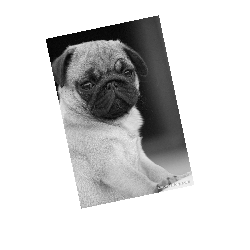

棕褐色版本的图像如何？
```javascript
fabric.Image.fromURL('pug.jpg', function(img) {
  img.filters.push(new fabric.Image.filters.Sepia());
  img.applyFilters();
  // 将图像添加到canvas上（还会重新渲染canvas）
  canvas.add(img);
})
```
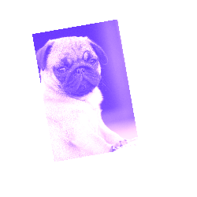

由于`filters`属性是一个简单的数组，我们可以用通常的方式对其执行任何所需的操作--删除过滤器（通过 `pop、splice` 或 `shift`）、添加过滤器（通过 `push、splice` 或 `unshift`），甚至合并多个过滤器。当我们调用 `applyFilters` 时，`filters`数组中的任何过滤器都将逐个应用。因此，让我们试着创建一幅棕褐色和明亮的图像。
```javascript
fabric.Image.fromURL('pug.jpg', function(img) {
  img.filters.push(
    new fabric.Image.filters.Sepia(),
    new fabric.Image.filters.Brightness({ brightness: 100 }));

  img.applyFilters();
  canvas.add(img);
});
```
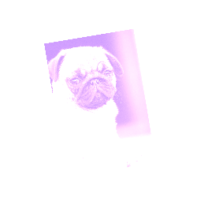

请注意，我们还向亮度滤镜传递了 `{ brightness: 100 }` object。这是因为有些滤镜无需任何额外配置即可应用（如灰度、反转、棕褐色），而有些滤镜则可以对其行为进行更精细的控制。对于亮度滤镜，它是实际的亮度级别（-1 全黑到 1 全白）。对于噪点过滤器，它是噪点值（0-1000）。对于 "去色 "滤镜，则是阈值和距离值。以此类推。

现在你已经熟悉了 Fabric 滤镜，是时候打破常规，创建自己的滤镜了！

创建过滤器的模板非常简单。我们需要创建一个 "类"，然后定义 applyTo 方法。我们还可以选择赋予过滤器 `toJSON` 方法（支持 JSON 序列化）和/或 `initialize` 方法（支持可选参数）。
```javascript
fabric.Image.filters.Redify = fabric.util.createClass(fabric.Image.filters.BaseFilter, {
  type: 'Redify',
  //片段着色器
  fragmentSource: 'precision highp float;\n' +
    'uniform sampler2D uTexture;\n' +
    'varying vec2 vTexCoord;\n' +
    'void main() {\n' +
      'vec4 color = texture2D(uTexture, vTexCoord);\n' +
      'color.g = 0.0;\n' +
      'color.b = 0.0;\n' +
      'gl_FragColor = color;\n' +
    '}',

  applyTo2d: function(options) {
    var imageData = options.imageData,
        data = imageData.data, i, len = data.length;

    for (i = 0; i < len; i += 4) {
      data[i + 1] = 0;
      data[i + 2] = 0;
    }

  }
});

fabric.Image.filters.Redify.fromObject = fabric.Image.filters.BaseFilter.fromObject;
```
我们将每个像素的绿色（`data[i+1]`）和蓝色（`data[i+2]`）分量替换为 0，实质上是删除它们。标准 rgb 三元组中的红色分量则保持不变，从而使整个图像被涂成红色。如图所示，`applyTo` 方法传递给我们一个选项object，其中包含过滤管道该阶段的图像数据。在此基础上，我们可以遍历图像的像素（`getImageData().data`），以任何方式对其进行修改。如果浏览器支持 WEBGL，滤镜就可以在 GPU 上运行。为此，您必须提供一个片段着色器，描述要对像素进行的操作。在 Fabric 中定义了许多过滤器，您可以查看如何编写片段或顶点着色器的示例

## 颜色
无论您更擅长使用十六进制、RGB 还是 RGBA 颜色，Fabric 都能为您提供坚实的色彩基础，帮助您最自然地表达自己。以下是在 Fabric 中定义颜色的一些方法：
```javascript
new fabric.Color('#f55');
new fabric.Color('#123123');
new fabric.Color('356735');
new fabric.Color('rgb(100,0,100)');
new fabric.Color('rgba(10, 20, 30, 0.5)');
``` 
`toHex()` 会将颜色实例转换为十六进制表示法，`toRgb()` - 转换为 RGB 表示法，`toRgba()` - 转换为带有 `alpha` 通道的 RGB 表示法。
```javascript
new fabric.Color('#f55').toRgb(); // "rgb(255,85,85)"
new fabric.Color('rgb(100,100,100)').toHex(); // "646464"
new fabric.Color('fff').toHex(); // "FFFFFF"
```
色彩转换并不是您唯一能做的事情。您还可以用一种颜色叠加另一种颜色，或将其转换为灰度版本。
```javascript
var redish = new fabric.Color('#f55');
var greenish = new fabric.Color('#5f5');

redish.overlayWith(greenish).toHex(); // "AAAA55"
redish.toGrayscale().toHex(); // "A1A1A1"
```
## 渐变色
渐变色是一种更具表现力的色彩处理方式。通过渐变，我们可以将一种颜色融合到另一种颜色中，创造出一些令人惊叹的图形效果。

Fabric 支持在所有object上设置渐变的填充或描边属性。要为object设置渐变，首先要创建渐变，然后将其指定为填充或描边。
```javascript
var circle = new fabric.Circle({
  left: 100,
  top: 100,
  radius: 50
});

var gradient = new fabric.Gradient({
  type: 'linear',
  gradientUnits: 'pixels', // 或者百分比
  coords: { x1: 0, y1: 0, x2: 0, y2: circle.height },
  colorStops:[
    { offset: 0, color: '#000' },
    { offset: 1, color: '#fff'}
  ]
})

circle.set('fill', gradient);
```
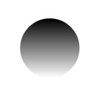
在上面的示例中，我们在 100,100 位置创建了一个半径为 50px 的圆。然后，我们将其填充设置为从黑到白的渐变，横跨该圆的整个高度。

梯度选项object有 2 个主要属性：坐标和 `colorStops`。坐标至少需要 2 个坐标对（x1, y1 和 x2, y2），用于定义梯度在object上的延伸方式，而 `colorStops` 是一个数组，用于定义梯度的颜色。数组中的每种颜色都由代表其在渐变上位置的偏移量、定义颜色本身的颜色以及最终的不透明度属性来定义。只要偏移量在 `0` 到 `1` 之间，你就可以定义任意多的色站。0 "代表渐变的开始，"1 "代表渐变的结束。坐标相对于object的左上角，因此圆的最高点为 0，最低点为 `circle.height`。
您可以指定线性或径向类型以获得两种不同的渐变效果，此外，`gradientUnits`（渐变单位）默认为像素，但也可以指定为`percentage`百分比 "允许以object大小的百分比来指定渐变大小，"1"表示object大小的 100%。 
此设置对于根据文本内容改变宽度或高度的 `fabric.Text` object非常有用。

下面是一个从左到右的红蓝渐变示例：
```javascript
 var gradient = new fabric.Gradient({
    type: 'linear',
    gradientUnits: 'pixels', 
    coords: { x1: 0, y1: 0, x2: circle.width, y2: 0 },
    colorStops:[
      { offset: 0, color: 'red' },
      { offset: 1, color: 'blue'}
    ]
  })

  var gradient = new fabric.Gradient({
    type: 'linear',
    gradientUnits: 'percentage',
    coords: { x1: 0, y1: 0, x2: 1, y2: 0 },
    colorStops:[
      { offset: 0, color: 'red' },
      { offset: 1, color: 'blue'}
    ]
  })
```
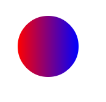

这里是 5 档彩虹渐变，颜色间隔均匀为 20%：
```javascript
var gradient = new fabric.Gradient({
  type: 'linear',
  gradientUnits: 'pixels', 
  coords: { x1: 0, y1: 0, x2: circle.width, y2: 0 },
  colorStops:[
    { offset: 0, color: 'red' },
    { offset: 0.2, color: 'orange' },
    { offset: 0.4, color: 'yellow' },
    { offset: 0.6, color: 'green' },
    { offset: 0.8, color: 'blue' },
    { offset: 1, color: 'purple' }
  ]
});
```
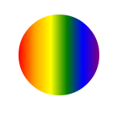

## 文本
如果您不仅想在canvas上显示图像和矢量形状，还想显示文字，该怎么办？Fabric为您提供了解决方案！认识一下Fabric文本object。

我们在 Fabric 中提供文本抽象有两个原因。首先，它允许以面向object的方式处理文本。本地canvas方法--像往常一样--只允许在很低的级别上填充或描边文本。通过实例化 fabric.Text 实例，我们可以像处理其他 Fabric object一样处理文本，如移动、缩放、更改属性等。

第二个原因是 Fabric 提供了比 canvas 更丰富的功能。Fabric 的一些新增功能包括

* Multiline support  不幸的是，本地文本方法会忽略新行。
* Text alignment 左、中、右对齐。在处理多行文本时非常有用。
* Text background 背景也尊重文本对齐方式。
* Text decoration 下划线、上划线、删除线。
* Line height 处理多行文本时有用。
* Char spacing 使文本更紧凑或间距更大
* Subranges 对文本object的子范围应用颜色和属性
* Multibyte 支持表情符号！
* On canvas editing 使用交互式类在canvas上编辑，可以直接在canvas上输入文本
hello world 示例如何？
```javascript
var text = new fabric.Text('hello world', { left: 100, top: 100 });
canvas.add(text);
```
没错！在canvas上显示文本就像在所需位置添加 `fabric.Text` 实例一样简单。如您所见，第一个参数只需要实际文本字符串。第二个参数是常用的选项object，它可以具有任何常用的 `left、top、fill、opacity`等属性。

当然，文本object也有自己独特的、与文本相关的属性。让我们来看看其中的一些
### fontFamily
该属性默认设置为 "Times New Roman"，允许我们更改用于渲染文本object的字体系列。更改后，文本将立即以新字体呈现。
```javascript
var comicSansText = new fabric.Text("I'm in Comic Sans", {
  fontFamily: 'Comic Sans'
});
```
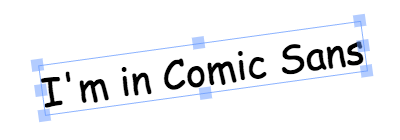

### fontSize
字体大小控制渲染文本的大小。请注意，与 Fabric 中的其他object不同，您不能直接更改文本的`width/heigth`属性。相反，您需要更改 `fontSize`值，才能使文本object变大或变小。或者你也可以使用 `scaleX/caleY` 属性。
```javascript
var text40 = new fabric.Text("I'm at fontSize 40", {
  fontSize: 40
});
var text20 = new fabric.Text("I'm at fontSize 20", {
  fontSize: 20
});
```
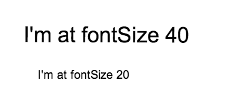

### fontWeight
字体大小可以让文字看起来更粗或更细。就像在 CSS 中一样，您可以使用关键字（"正常"、"粗体"）或数字（100、200、400、600、800）。需要注意的是，能否使用特定权重取决于所选字体是否具备该权重。如果您使用的是远程字体，则需要确保同时提供正常和粗体（以及其他所需的权重）字体定义。
```javascript
var normalText = new fabric.Text("I'm a normal text", {
  fontWeight: 'normal'
});
var boldText = new fabric.Text("I'm at bold text", {
  fontWeight: 'bold'
});
```
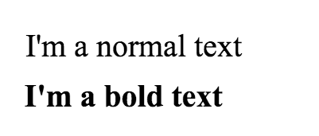
### textDecoration
文本装饰可为文本添加下划线、上划线或删除线。这与 CSS 类似，但 Fabric 更进一步，允许同时使用上述几种功能的任意组合。因此，你可以让文本既有下划线又有上划线，或者既有下划线又有删除线，等等。
```javascript
var underlineText = new fabric.Text("I'm an underlined text", {
  underline: true
});
var strokeThroughText = new fabric.Text("I'm a stroke-through text", {
  linethrough: true
});
var overlineText = new fabric.Text("I'm an overline text", {
  overline: true
});
```
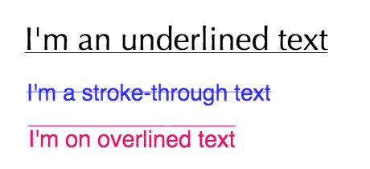

### shadow
文字阴影由 4 部分组成：颜色、水平偏移、垂直偏移和模糊大小。如果你使用过 CSS 中的阴影，可能会觉得非常熟悉。通过更改这些值可以实现多种组合。
```javascript
var shadowText1 = new fabric.Text("I'm a text with shadow", {
  shadow: 'rgba(0,0,0,0.3) 5px 5px 5px'
});
var shadowText2 = new fabric.Text("And another shadow", {
  shadow: 'rgba(0,0,0,0.2) 0 0 5px'
});
var shadowText3 = new fabric.Text("Lorem ipsum dolor sit", {
  shadow: 'green -5px -5px 3px'
});
```
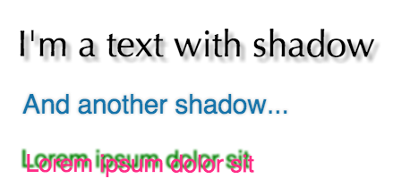   

### fontStyle
字体样式可以是两种值之一：正常或斜体。这与同名的 CSS 属性类似。
```javascript
var italicText = new fabric.Text("A very fancy italic text", {
  fontStyle: 'italic',
  fontFamily: 'Delicious'
});
var anotherItalicText = new fabric.Text("another italic text", {
  fontStyle: 'italic',
  fontFamily: 'Hoefler Text'
});
```
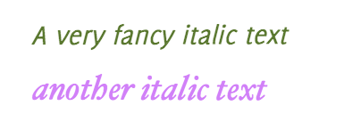

### stroke and strokeWidth
通过结合描边（描边的颜色）和描边宽度（描边的宽度），可以在文本上实现一些有趣的效果。下面是几个例子：
```javascript
var textWithStroke = new fabric.Text("Text with a stroke", {
  stroke: '#ff1318',
  strokeWidth: 1
});
var loremIpsumDolor = new fabric.Text("Lorem ipsum dolor", {
  fontFamily: 'Impact',
  stroke: '#c3bfbf',
  strokeWidth: 3
});
```
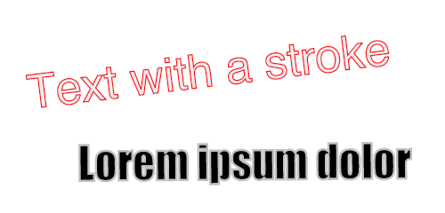
### textAlign
文本对齐在处理多行文本时非常有用。对于单行文本，边界框的宽度总是与该行的宽度完全一致，因此无需对齐。

允许的值有 "左对齐"、"居中 "和 "右对齐"。
```javascript
var text = 'this is\na multiline\ntext\naligned right!';
var alignedRightText = new fabric.Text(text, {
  textAlign: 'right'
});
```
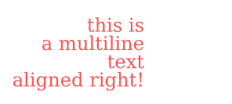
### lineHeight
另一个在 CSS 领域可能并不陌生的属性是 `lineHeight`。它允许我们改变多行文本中文本行间的垂直间距。在下面的示例中，第一行文字的 `lineHeight` 为 3，第二行文字的 `lineHeight` 为 1。
```javascript
var lineHeight3 = new fabric.Text('Lorem ipsum ...', {
  lineHeight: 3
});
var lineHeight1 = new fabric.Text('Lorem ipsum ...', {
  lineHeight: 1
});
```
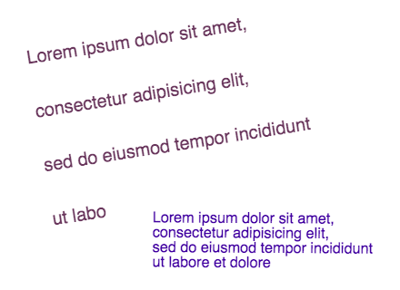
### textBackgroundColor
最后，`textBackgroundColor` 可以为文本添加背景。请注意，背景只填充文本字符所占的空间，而不是整个边界框。这意味着文本对齐方式会改变文本背景的渲染方式。行高也会改变，因为背景会尊重由 `lineHeight` 创建的行间垂直空间。
```javascript
var text = 'this is\na multiline\ntext\nwith\ncustom lineheight\n&background';
var textWithBackground = new fabric.Text(text, {
  textBackgroundColor: 'rgb(0,200,0)'
});
```
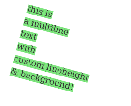
## Events
事件驱动架构是在框架内实现惊人的强大功能和灵活性的基础。Fabric 也不例外，它提供了一个广泛的事件系统，从低级的 `mouse`事件到高级的object事件。

通过这些事件，我们可以了解canvas上发生的各种行为。想知道鼠标何时被按下？只需监测 `mouse:down`事件即可。想知道object何时被添加到canvas上吗？`object:added`事件就能帮你解决这个问题。整个canvas被重新渲染时呢？只需使用`after:render`即可。

事件 API 非常简单，类似于` jQuery、Underscore.js` 或其他流行的 JS 库。有一个方法用于初始化事件监听器，还有一个方法用于移除事件监听器。

让我们来看一个实际例子：
```javascript
var canvas = new fabric.Canvas('...');
canvas.on('mouse:down', function(options) {
  console.log(options.e.clientX, options.e.clientY);
});
```
我们将在canvas上添加事件`mouse:down`事件监听器，并赋予它一个事件处理程序，以记录事件发生的坐标。换句话说，它会记录鼠标在canvas上按下的具体位置。事件处理程序接收一个选项object，该object有两个属性：`e` - 原始事件；`target` - canvas上被点击的object（如果有）。事件始终存在，但目标只有在您确实点击了canvas上的某个object时才存在。此外，只有在有意义的情况下，才会将 `target` 传递给事件的处理程序。例如`mouse:down`事件会传递目标，但`after:render`事件（表示重新绘制整个canvas）不会传递目标。
```javascript
canvas.on('mouse:down', function(options) {
  if (options.target) {
    console.log('an object was clicked! ', options.target.type);
  }
});
```
如果您点击了一个object，上面的示例将记录 "点击了一个object！"。它还会显示被点击object的类型。

那么，Fabric 还提供哪些其他事件呢？从鼠标级事件来看，有`mouse:down`、`mouse:move`和`mouse:up`。通用事件有`after:render`。然后是与选择相关的事件：`before:selection:cleared`、`selection:created`和`selection:cleared`。最后是object事件：`object:modified`，`object:selected`，`object:moving`，`object:scaling`，`object:rotating`，`object:added`，`object:removed`。

请注意，`object:moving`（或 `object:scaling`）等事件在object每次移动（或缩放）（哪怕是一个像素）时都会连续触发。另一方面，`object:modified`或 `selection:created`等事件只有在操作（object修改或选择创建）结束时才会触发。

请注意我们是如何将事件直接附加到canvas上的`（canvas.on('mouse:down', ...)）`。可以想象，这意味着所有事件的作用域都是canvas实例。如果页面上有多个canvas，则可以为每个canvas附加不同的事件监听器。它们都是独立的，只负责分配给它们的事件。

为了方便起见，Fabric 进一步完善了事件系统，允许您直接将监听器附加到`Fabric.object`上。让我们来看看：
```javascript
var rect = new fabric.Rect({ width: 100, height: 50, fill: 'green' });
rect.on('selected', function() {
  console.log('selected a rectangle');
});

var circle = new fabric.Circle({ radius: 75, fill: 'blue' });
circle.on('selected', function() {
  console.log('selected a circle');
});
```
我们将事件监听器直接附加到矩形和圆形实例上。我们使用的是 `selected`事件，而不是`object:selected`事件。同样，我们也可以使用`modified`事件（附加到canvas时使用`object:modified`）、`rotating`事件（附加到canvas时使用`object:rotating`）等。

[下一节](./part2.md)