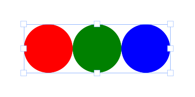

# Fabric.js简介第2部分
在本系列的第一和第二部分中，我们已经介绍了大部分基础知识。下面，让我们进入更高级的内容！

## 组（Groups）


我们首先要讨论的是组。组是 Fabric 最强大的功能之一。它们就像它们听起来一样，是将任何 Fabric object组合成一个实体的简单方法。我们为什么要这样做呢？当然是为了能够将这些object作为一个整体来处理！

还记得如何用鼠标将canvas上的任意多个fabric object分组，形成一个选区吗？分组后，所有object都可以移动，甚至可以一起修改。它们组成一个组。我们可以对该组进行缩放、旋转，甚至更改其显示属性--颜色、透明度、边框等。

这正是组的作用所在，每当你在canvas上看到这样的选区时，Fabric 都会在幕后隐式地创建一个object组。因此，提供以编程方式处理组的访问权限才是合理的。这就是 `fabric.Group` 的作用。

让我们创建一个包含 2 个object（圆形和文本）的组：
```javascript
var circle = new fabric.Circle({
  radius: 100,
  fill: '#eef',
  scaleY: 0.5,
  originX: 'center',
  originY: 'center'
});

var text = new fabric.Text('hello world', {
  fontSize: 30,
  originX: 'center',
  originY: 'center'
});

var group = new fabric.Group([ circle, text ], {
  left: 150,
  top: 100,
  angle: -10
});

canvas.add(group)
```
首先，我们创建了一个 "hello world"文本object。将 `originX` 和 `originY` 设置为 `center`将使其在组内居中；默认情况下，组内成员的方向相对于组的左上角。然后，创建一个半径为 100px 的圆，填充 "#eef"色并垂直缩放`（scaleY=0.5）`。然后，我们创建了一个 `fabric.Group` 实例，将这两个object通过数组传递给它，并赋予它 150/100 的位置和 -10 的角度。最后，像添加其他object一样，将该组添加到canvas中。

好了！你会在canvas上看到一个object，看起来就像一个带标签的椭圆。请注意，为了修改该object，我们只需更改一个组的属性，赋予它自定义的左、上和角度值。现在，您可以将该object作为一个单独的实体来处理。


现在我们在canvas上有了一个组，让我们来改变一下：
```javascript
// 要使用 setFill，需要从 src/util/named_accessors.mixins.js 添加可选的 setter/getter代码 
group.item(0).set('fill', 'red');
group.item(1).set({
  text: 'trololo',
  fill: 'white'
});
```
这是怎么回事？我们正在通过 `item()` 方法访问组中的单个object，并修改它们的属性。第一个object是被挤压的圆，第二个object是文本。让我们看看会发生什么


你现在可能已经注意到一件重要的事情，那就是组中的所有object都是相对于组中心定位的。当我们更改文本object的文本时，即使更改了宽度，它也会保持居中。如果不希望出现这种情况，则需要指定object的`left/top`坐标。在这种情况下，它们将根据这些坐标分组。

让我们创建并分组 3 个圆，使它们一个接一个地水平放置：
```javascript
var circle1 = new fabric.Circle({
  radius: 50,
  fill: 'red',
  left: 0
});
var circle2 = new fabric.Circle({
  radius: 50,
  fill: 'green',
  left: 100
});
var circle3 = new fabric.Circle({
  radius: 50,
  fill: 'blue',
  left: 200
});

var group = new fabric.Group([ circle1, circle2, circle3 ], {
  left: 200,
  top: 100
});

canvas.add(group);
```


使用群组时还需注意object的状态。例如，当使用图片组成一个组时，需要确保这些图片已完全加载。由于 Fabric 已经提供了确保图片已加载的辅助方法，因此这变得相当容易：
```javascript
fabric.Image.fromURL('/assets/pug.jpg', function(img) {
  var img1 = img.scale(0.1).set({ left: 100, top: 100 });

  fabric.Image.fromURL('/assets/pug.jpg', function(img) {
    var img2 = img.scale(0.1).set({ left: 175, top: 175 });

    fabric.Image.fromURL('/assets/pug.jpg', function(img) {
      var img3 = img.scale(0.1).set({ left: 250, top: 250 });

      canvas.add(new fabric.Group([ img1, img2, img3], { left: 200, top: 200 }))
    });
  });
});
```


那么，在处理组时还有哪些方法可用呢？有一个 `getObjects()` 方法，其工作原理与 `fabric.Canvas#getObjects()` 方法完全相同，并返回一个组中所有object的数组。`size()`表示组中所有object的数量。`contains()` 可以检查特定object是否在组中。还有 `item()`，我们在前面已经看到过，它允许检索组中的特定object。还有 `forEachObject()`，再次镜像了 `fabric.Canvas#forEachObject`，只是与组object有关。最后是 `add()` 和 `remove()` 方法，用于相应地从组中添加和删除object。

从组添加/删除object有两种方式--更新组尺寸/位置和不更新组尺寸/位置。我们建议使用更新尺寸，除非您正在进行批量操作，并且在操作过程中不会出现组的宽度/高度出错的问题。

在组的中心添加矩形：
```javascript
group.add(new fabric.Rect({
  ...
  originX: 'center',
  originY: 'center'
}));
```
添加偏离组中心 100px 的矩形：
```javascript
group.add(new fabric.Rect({
  ...
  left: 100,
  top: 100,
  originX: 'center',
  originY: 'center'
}));
```
在组的中心添加矩形并更新组的尺寸：
```javascript
group.addWithUpdate(new fabric.Rect({
  ...
  left: group.get('left'),
  top: group.get('top'),
  originX: 'center',
  originY: 'center'
}));
```
添加偏离组中心 100px 的矩形并更新组的尺寸：
```javascript
group.addWithUpdate(new fabric.Rect({
  ...
  left: group.get('left') + 100,
  top: group.get('top') + 100,
  originX: 'center',
  originY: 'center'
}));
```
最后，如果你想用canvas上已有的object创建一个组，你需要先克隆它们：
```javascript
// 用现有 (2) object的副本创建一个组
var group = new fabric.Group([
  canvas.item(0).clone(),
  canvas.item(1).clone()
]);

// 删除所有object并重新渲染
canvas.clear().renderAll();

// 将组加入到canvas中
canvas.add(group);
```
## 序列化
一旦您开始构建某种有状态的应用程序，或许允许用户在服务器上保存canvas内容的结果，或将内容流式传输到不同的客户端，您就需要对canvas进行序列化。您还能如何发送canvas内容？当然，您可以将canvas导出为图片，但将图片上传到服务器肯定会占用大量带宽。就大小而言，没有什么比文本更合适，这正是 Fabric 为canvas序列化/反序列化提供出色支持的原因。
### toObject, toJSON
Fabric 中canvas序列化的支柱是 `fabric.Canvas#toObject()` 和 `fabric.Canvas#toJSON()` 方法。让我们来看一个简单的示例，首先序列化一个空canvas：
```javascript
var canvas = new fabric.Canvas('c');
JSON.stringify(canvas); // '{"objects":[],"background":"rgba(0, 0, 0, 0)"}'
```
我们使用 ES5 `JSON.stringify()` 方法，该方法会隐式调用传递object上的 `toJSON` 方法（如果存在该方法）。由于 Fabric 中的 canvas 实例具有 `toJSON` 方法，因此就好像我们调用了 `JSON.stringify(canvas.toJSON())` 方法。

请注意返回的字符串表示空canvas。它采用 JSON 格式，主要由`objects`和 `background`属性组成。`object`属性当前为空，因为canvas上什么都没有，而 `background` 属性的默认值为透明`rgba(0, 0, 0, 0)`。

让我们赋予canvas不同的背景，看看情况会有什么变化：
```javascript
canvas.backgroundColor = 'red';
JSON.stringify(canvas); // '{"objects":[],"background":"red"}'
```
不出所料，canvas表示法现在会反映出新的背景颜色。现在，让我们添加一些object！
```javascript
canvas.add(new fabric.Rect({
  left: 50,
  top: 50,
  height: 20,
  width: 20,
  fill: 'green'
}));
console.log(JSON.stringify(canvas));

/*
'{"objects":[{"type":"rect","left":50,"top":50,"width":20,"height":20,"fill":"green","overlayFill":null,"stroke":null,"strokeWidth":1,"strokeDashArray":null,"scaleX":1,"scaleY":1,"angle":0,"flipX":false,"flipY":false,"opacity":1,"selectable":true,"hasControls":true,"hasBorders":true,"hasRotatingPoint":false,"transparentCorners":true,"perPixelTargetFind":false,"rx":0,"ry":0}],"background":"rgba(0, 0, 0, 0)"}'
*/
```
哇。乍一看变化很大，但仔细一看，我们会发现这是一个新添加的object，现在是 "object"数组的一部分，已经序列化为 JSON 格式。请注意，它的表示方式包含了所有的视觉特征--左、上、宽、高、填充、描边等等。

如果我们要添加另一个object，比如说，在矩形旁边添加一个红色圆圈，你就会看到它的表示也会相应改变：
```javascript
canvas.add(new fabric.Circle({
  left: 100,
  top: 100,
  radius: 50,
  fill: 'red'
}));
console.log(JSON.stringify(canvas));
/*
'{"objects":[{"type":"rect","left":50,"top":50,"width":20,"height":20,"fill":"green","overlayFill":null,"stroke":null,"strokeWidth":1,"strokeDashArray":null,"scaleX":1,"scaleY":1,"angle":0,"flipX":false,"flipY":false,"opacity":1,"selectable":true,"hasControls":true,"hasBorders":true,"hasRotatingPoint":false,"transparentCorners":true,"perPixelTargetFind":false,"rx":0,"ry":0},{"type":"circle","left":100,"top":100,"width":100,"height":100,"fill":"red","overlayFill":null,"stroke":null,"strokeWidth":1,"strokeDashArray":null,"scaleX":1,"scaleY":1,"angle":0,"flipX":false,"flipY":false,"opacity":1,"selectable":true,"hasControls":true,"hasBorders":true,"hasRotatingPoint":false,"transparentCorners":true,"perPixelTargetFind":false,"radius":50}],"background":"rgba(0, 0, 0, 0)"}'
*/
```
虽然一开始看起来输出量很大，但与图像序列化相比，这根本不算什么，使用 canvas.toDataURL('png') 得到的字符串的大小大约是json的十倍。

您可能想知道为什么 `fabric.Canvas#toObject` 也会出现。很简单，toObject 返回与 toJSON 相同的表示形式，只是以实际object的形式返回，而不进行字符串序列化。例如，以之前的canvas为例，canvas上只有一个绿色的矩形，`canvas.toObject()` 的输出结果是这样的：
```json
{ "background" : "rgba(0, 0, 0, 0)",
  "objects" : [
    {
      "angle" : 0,
      "fill" : "green",
      "flipX" : false,
      "flipY" : false,
      "hasBorders" : true,
      "hasControls" : true,
      "hasRotatingPoint" : false,
      "height" : 20,
      "left" : 50,
      "opacity" : 1,
      "overlayFill" : null,
      "perPixelTargetFind" : false,
      "scaleX" : 1,
      "scaleY" : 1,
      "selectable" : true,
      "stroke" : null,
      "strokeDashArray" : null,
      "strokeWidth" : 1,
      "top" : 50,
      "transparentCorners" : true,
      "type" : "rect",
      "width" : 20
    }
  ]
}
```
如您所见，`toJSON` 输出本质上是字符串化的 `toObject` 输出。现在，有趣（和有用！）的是，`toObject` 输出是智能和傻瓜的。您在 `objects`数组中看到的是遍历所有canvasobject并将其委托给各自的 `toObject` 方法的结果。在真正的面向object方式中，所有object都能自我序列化。

这意味着，当你创建自己的 "类 "时，或者只是需要定制object的序列化表示时，你需要做的就是使用 `toObject` 方法,要么完全替换它，要么扩展它。让我们试试这个：
```javascript
var rect = new fabric.Rect();
rect.toObject = function() {
  return { name: 'trololo' };
};
canvas.add(rect);
console.log(JSON.stringify(canvas));
```
```json
'{"objects":[{"name":"trololo"}],"background":"rgba(0, 0, 0, 0)"}'
```
正如你所看到的，object数组现在有了我们矩形的自定义表示。这种覆盖可能不是很有用--尽管能表达出重点--所以我们不如用额外的属性来扩展矩形的 `toObject` 方法。
```javascript
var rect = new fabric.Rect();

rect.toObject = (function(toObject) {
  return function() {
    return fabric.util.object.extend(toObject.call(this), {
      name: this.name
    });
  };
})(rect.toObject);

canvas.add(rect);

rect.name = 'trololo';

console.log(JSON.stringify(canvas));

```
输出：
```json
'{"objects":[{"type":"rect","left":0,"top":0,"width":0,"height":0,"fill":"rgb(0,0,0)","overlayFill":null,"stroke":null,"strokeWidth":1,"strokeDashArray":null,"scaleX":1,"scaleY":1,"angle":0,"flipX":false,"flipY":false,"opacity":1,"selectable":true,"hasControls":true,"hasBorders":true,"hasRotatingPoint":false,"transparentCorners":true,"perPixelTargetFind":false,"rx":0,"ry":0,"name":"trololo"}],"background":"rgba(0, 0, 0, 0)"}'
```
我们使用附加属性`name`扩展了object现有的 `toObject` 方法，因此该属性现在是 `toObject` 输出的一部分，并因此出现在canvas的 JSON 表示中。还有一点值得一提，如果像这样扩展object，还需要确保object的 "类"（本例中为 `fabric.Rect`）在 `stateProperties`数组中包含该属性，以便从JSON载入canvas时能正确解析并将其添加到object中。

您可以将object标记为不可导出，将 `excludeFromExport` 设置为 true。这样，在序列化过程中就不会保存canvas上的某些辅助object。
### toSVG
另一种高效的基于文本的canvas表示法是 SVG 格式。由于 Fabric 擅长在canvas上进行 SVG 解析和呈现，因此将其作为一个双向过程并提供canvas到 SVG 的转换是非常合理的。让我们在canvas上添加相同的矩形，看看 toSVG 方法会返回什么样的表示形式：
```javascript
canvas.add(new fabric.Rect({
  left: 50,
  top: 50,
  height: 20,
  width: 20,
  fill: 'green'
}));
console.log(canvas.toSVG());
```
输出：
```xml
'<?xml version="1.0" standalone="no" ?><!DOCTYPE svg PUBLIC "-//W3C//DTD SVG 20010904//EN" "http://www.w3.org/TR/2001/REC-SVG-20010904/DTD/svg10.dtd"><svg xmlns="http://www.w3.org/2000/svg" xmlns:xlink="http://www.w3.org/1999/xlink" version="1.1" width="800" height="700" xml:space="preserve"><desc>Created with Fabric.js 0.9.21</desc><rect x="-10" y="-10" rx="0" ry="0" width="20" height="20" style="stroke: none; stroke-width: 1; stroke-dasharray: ; fill: green; opacity: 1;" transform="translate(50 50)" /></svg>'
```
与 `toJSON` 和 `toObject` 一样，在canvas上调用 `toSVG` 时，也会将其逻辑委托给各个object，而每个object都有自己的 `toSVG` 方法，该方法是针对object类型而设计的。如果您需要修改或扩展某个object的 SVG 表示形式，您可以使用 `toSVG` 完成与 toOb`ject 相同的操作。

与 Fabric 专有的 `toObject/toJSON` 相比，SVG 表示法的好处在于，您可以将其扔进任何支持 SVG 的呈现器（浏览器、应用程序、打印机、相机等）中，它就能正常工作。而使用 `toObject/toJSON` 时，您首先需要将其加载到canvas上。说到将内容加载到canvas上，既然我们可以将canvas序列化为高效的文本块，那么如何将其加载回canvas上呢？
## Deserialization, SVG parser (反序列化)
与序列化类似，从字符串加载canvas也有两种方法：从 JSON 表示法或从 SVG 表示法。使用 JSON 表示法时，有 `fabric.Canvas#loadFromJSON` 和 `fabric.Canvas#loadFromDatalessJSON` 方法。使用 SVG 时，有 `fabric.loadSVGFromURL` 和 `fabric.loadSVGFromString` 方法。

请注意，前两个方法是实例方法，直接在canvas实例上调用，而后两个方法是静态方法，在 "fabric "object而非canvas上调用。

这些方法没什么好说的。它们完全按照你的预期工作。例如，让我们将之前从canvas输出的 JSON 加载到干净的canvas上：
```javascript
var canvas = new fabric.Canvas();

canvas.loadFromJSON('{"objects":[{"type":"rect","left":50,"top":50,"width":20,"height":20,"fill":"green","overlayFill":null,"stroke":null,"strokeWidth":1,"strokeDashArray":null,"scaleX":1,"scaleY":1,"angle":0,"flipX":false,"flipY":false,"opacity":1,"selectable":true,"hasControls":true,"hasBorders":true,"hasRotatingPoint":false,"transparentCorners":true,"perPixelTargetFind":false,"rx":0,"ry":0},{"type":"circle","left":100,"top":100,"width":100,"height":100,"fill":"red","overlayFill":null,"stroke":null,"strokeWidth":1,"strokeDashArray":null,"scaleX":1,"scaleY":1,"angle":0,"flipX":false,"flipY":false,"opacity":1,"selectable":true,"hasControls":true,"hasBorders":true,"hasRotatingPoint":false,"transparentCorners":true,"perPixelTargetFind":false,"radius":50}],"background":"rgba(0, 0, 0, 0)"}');
```
... 两个物体就会 "神奇地 "出现在canvas上：


因此，从字符串加载canvas非常简单。但那个看起来很奇怪的 loadFromDatalessJSON 方法又是怎么回事呢？它与我们刚刚使用的 loadFromJSON 到底有什么不同？为了理解为什么我们需要这个方法，我们需要看看序列化的canvas，它有一个或多或少复杂的pathobject。比如这个：


...而该形状的 `JSON.stringify(canvas)` 输出为
```json
{"objects":[{"type":"path","left":184,"top":177,"width":175,"height":151,"fill":"#231F20","overlayFill":null,"stroke":null,"strokeWidth":1,"strokeDashArray":null,"scaleX":1,"scaleY":1,"angle":-19,"flipX":false,"flipY":false,"opacity":1,"selectable":true,"hasControls":true,"hasBorders":true,"hasRotatingPoint":false,"transparentCorners":true,"perPixelTargetFind":false,"path":[["M",39.502,61.823],["c",-1.235,-0.902,-3.038,-3.605,-3.038,-3.605],["s",0.702,0.4,3.907,1.203],["c",3.205,0.8,7.444,-0.668,10.114,-1.97],["c",2.671,-1.302,7.11,-1.436,9.448,-1.336],["c",2.336,0.101,4.707,0.602,4.373,2.036],["c",-0.334,1.437,-5.742,3.94,-5.742,3.94],["s",0.4,0.334,1.236,0.334],["c",0.833,0,6.075,-1.403,6.542,-4.173],["s",-1.802,-8.377,-3.272,-9.013],["c",-1.468,-0.633,-4.172,0,-4.172,0],["c",4.039,1.438,4.941,6.176,4.941,6.176],["c",-2.604,-1.504,-9.279,-1.234,-12.619,0.501],["c",-3.337,1.736,-8.379,2.67,-10.083,2.503],["c",-1.701,-0.167,-3.571,-1.036,-3.571,-1.036],["c",1.837,0.034,3.239,-2.669,3.239,-2.669],["s",-2.068,2.269,-5.542,0.434],["c",-3.47,-1.837,-1.704,-8.18,-1.704,-8.18],["s",-2.937,5.909,-1,9.816],["C",34.496,60.688,39.502,61.823,39.502,61.823],["z"],["M",77.002,40.772],["c",0,0,-1.78,-5.03,-2.804,-8.546],["l",-1.557,8.411],["l",1.646,1.602],["c",0,0,0,-0.622,-0.668,-1.691],["C",72.952,39.48,76.513,40.371,77.002,40.772],["z"],["M",102.989,86.943],["M",102.396,86.424],["c",0.25,0.22,0.447,0.391,0.594,0.519],["C",102.796,86.774,102.571,86.578,102.396,86.424],["z"],["M",169.407,119.374],["c",-0.09,-5.429,-3.917,-3.914,-3.917,-2.402],["c",0,0,-11.396,1.603,-13.086,-6.677],["c",0,0,3.56,-5.43,1.69,-12.461],["c",-0.575,-2.163,-1.691,-5.337,-3.637,-8.605],["c",11.104,2.121,21.701,-5.08,19.038,-15.519],["c",-3.34,-13.087,-19.63,-9.481,-24.437,-9.349],["c",-4.809,0.135,-13.486,-2.002,-8.011,-11.618],["c",5.473,-9.613,18.024,-5.874,18.024,-5.874],["c",-2.136,0.668,-4.674,4.807,-4.674,4.807],["c",9.748,-6.811,22.301,4.541,22.301,4.541],["c",-3.097,-13.678,-23.153,-14.636,-30.041,-12.635],["c",-4.286,-0.377,-5.241,-3.391,-3.073,-6.637],["c",2.314,-3.473,10.503,-13.976,10.503,-13.976],["s",-2.048,2.046,-6.231,4.005],["c",-4.184,1.96,-6.321,-2.227,-4.362,-6.854],["c",1.96,-4.627,8.191,-16.559,8.191,-16.559],["c",-1.96,3.207,-24.571,31.247,-21.723,26.707],["c",2.85,-4.541,5.253,-11.93,5.253,-11.93],["c",-2.849,6.943,-22.434,25.283,-30.713,34.274],["s",-5.786,19.583,-4.005,21.987],["c",0.43,0.58,0.601,0.972,0.62,1.232],["c",-4.868,-3.052,-3.884,-13.936,-0.264,-19.66],["c",3.829,-6.053,18.427,-20.207,18.427,-20.207],["v",-1.336],["c",0,0,0.444,-1.513,-0.089,-0.444],["c",-0.535,1.068,-3.65,1.245,-3.384,-0.889],["c",0.268,-2.137,-0.356,-8.549,-0.356,-8.549],["s",-1.157,5.789,-2.758,5.61],["c",-1.603,-0.179,-2.493,-2.672,-2.405,-5.432],["c",0.089,-2.758,-1.157,-9.702,-1.157,-9.702],["c",-0.8,11.75,-8.277,8.011,-8.277,3.74],["c",0,-4.274,-4.541,-12.82,-4.541,-12.82],["s",2.403,14.421,-1.336,14.421],["c",-3.737,0,-6.944,-5.074,-9.879,-9.882],["C",78.161,5.874,68.279,0,68.279,0],["c",13.428,16.088,17.656,32.111,18.397,44.512],["c",-1.793,0.422,-2.908,2.224,-2.908,2.224],["c",0.356,-2.847,-0.624,-7.745,-1.245,-9.882],["c",-0.624,-2.137,-1.159,-9.168,-1.159,-9.168],["c",0,2.67,-0.979,5.253,-2.048,9.079],["c",-1.068,3.828,-0.801,6.054,-0.801,6.054],["c",-1.068,-2.227,-4.271,-2.137,-4.271,-2.137],["c",1.336,1.783,0.177,2.493,0.177,2.493],["s",0,0,-1.424,-1.601],["c",-1.424,-1.603,-3.473,-0.981,-3.384,0.265],["c",0.089,1.247,0,1.959,-2.849,1.959],["c",-2.846,0,-5.874,-3.47,-9.078,-3.116],["c",-3.206,0.356,-5.521,2.137,-5.698,6.678],["c",-0.179,4.541,1.869,5.251,1.869,5.251],["c",-0.801,-0.443,-0.891,-1.067,-0.891,-3.473],...

```
并且这只是全部输出的5分之一

这是怎么回事？原来，这个 `fabric.Path` 实例--这个形状--由数百条贝塞尔线组成，这些贝塞尔线决定了渲染的具体方式。JSON 表示法中的所有 ["c",0,2.67,-0.979,5.253,-2.048,9.079]块都与这些曲线一一对应。如果有数百（甚至数千）条这样的曲线，canvas表示法就会变得非常庞大。

怎么办？

这时，`fabric.Canvas#toDatalessJSON` 就派上用场了。让我们试试看
```javascript
canvas.item(0).sourcePath = '/assets/dragon.svg';
console.log(JSON.stringify(canvas.toDatalessJSON()));
```
输出：
```json
{"objects":[{"type":"path","left":143,"top":143,"width":175,"height":151,"fill":"#231F20","overlayFill":null,"stroke":null,"strokeWidth":1,"strokeDashArray":null,"scaleX":1,"scaleY":1,"angle":-19,"flipX":false,"flipY":false,"opacity":1,"selectable":true,"hasControls":true,"hasBorders":true,"hasRotatingPoint":false,"transparentCorners":true,"perPixelTargetFind":false,"path":"/assets/dragon.svg"}],"background":"rgba(0, 0, 0, 0)"}
```
嗯，确实小了不少！然后呢？请注意，在调用 `toDatalessJSON` 之前，我们赋予了path（龙形）object `sourcePath`属性`/assets/dragon.svg`。然后，当我们调用 `toDatalessJSON` 时，之前输出的整个庞大path字符串（数百条path命令）就被替换成了一个 `dragon.svg`字符串。

在处理大量复杂图形时，`toDatalessJSON` 可以让我们进一步减少输出，用一个简单的 SVG 链接取代庞大的path数据表示。

现在回到 `loadFromDatalessJSON` 方法您或许可以猜到，它只是允许从无数据版本的canvas描述中加载canvas。 `loadFromDatalessJSON`大概知道如何获取这些 `path`字符串（如"/assets/dragon.svg"）、加载它们并将其用作相应path object的数据。

现在，让我们来看看 SVG 加载方法。我们可以使用字符串或 URL：
```javascript
fabric.loadSVGFromString('...', function(objects, options) {
  var obj = fabric.util.groupSVGElements(objects, options);
  canvas.add(obj).renderAll();
});
```
第一个参数是 SVG 字符串，第二个参数是回调函数。回调函数会在 SVG 解析和加载完成后调用，并接收两个参数--`object`和`options`。object包含一个从 SVG 解析出来的object数组--path、path组（用于复杂object）、图像、文本等。为了将所有这些object组合成一个有联系的集合，并使它们看起来与 SVG 文档中的一样，我们使用了 `fabric.util.groupSVGElements`，并将object和选项都传给了它。我们将获得 `fabric.Path` 或 `fabric.Group` 的实例，然后将其添加到画布上。

`fabric.loadSVGFromURL` 的工作方式与此相同，只是传递的是包含 URL 而非 SVG 内容的字符串。请注意，Fabric 会尝试通过 `XMLHttpRequest` 获取 URL，因此 SVG 需要符合通常的 SOP 规则。

## 子类
由于 Fabric 是以真正面向对象的方式构建的，因此其设计使子类和扩展变得简单而自然。正如您在本系列第一部分中了解到的，Fabric 中已有一个对象层次结构。所有 2D 对象（路径、图像、文本等）都继承自 `fabric.Object`，有些 "类"（如 `fabric.IText`）甚至形成了 3 级继承。

那么，我们该如何子类化 Fabric 中现有的某个 "类 "呢？甚至创建我们自己的 "类"？

为此，我们需要 `fabric.util.createClass` 实用程序方法。`createClass` 只是对 Javascript 原型继承的简单抽象。让我们先创建一个简单的 Point "类"
```javascript
var Point = fabric.util.createClass({
  initialize: function(x, y) {
    this.x = x || 0;
    this.y = y || 0;
  },
  toString: function() {
    return this.x + '/' + this.y;
  }
});
```
createClass 接收一个对象，并使用该对象的属性创建具有实例级属性的 "类"。唯一经过特殊处理的属性是 "initialize"，它被用作构造函数。因此，在初始化 Point 时，我们将创建一个带有 "x "和 "y "属性以及 "toString "方法的实例：
```javascript
var point = new Point(10, 20);

point.x; // 10
point.y; // 20

point.toString(); // "10/20"
```
如果我们想创建一个 "点 "类的子类，比如一个彩色点，我们可以这样使用 createClass：
```javascript
var ColoredPoint = fabric.util.createClass(Point, {
  initialize: function(x, y, color) {
    this.callSuper('initialize', x, y);
    this.color = color || '#000';
  },
  toString: function() {
    return this.callSuper('toString') + ' (color: ' + this.color + ')';
  }
});
```
请注意，带有实例级属性的对象现在是作为第二个参数传递的。而第一个参数接收`Point` "类"，这就告诉 createClass 将它作为这个类的父 "类"。为了避免重复，我们使用了 callSuper 方法，它调用父 "类"的方法。这意味着，如果我们更改 Point，这些更改也会传播到 `ColoredPoint` 中。查看 `ColoredPoint` 的实际应用：
```javascript
var redPoint = new ColoredPoint(15, 33, '#f55');

redPoint.x; // 15
redPoint.y; // 33
redPoint.color; // "#f55"

redPoint.toString(); "15/33 (color: #f55)"
```
既然我们已经创建了自己的 "类 "和 "子类"，那么现在让我们看看如何使用已有的 Fabric 类。例如，让我们创建一个 `LabeledRect` "类"，它大致是一个带有文本标签的矩形。在画布上呈现时，该标签将表现为矩形内的文本。这与之前使用圆形和文本的组示例类似。在使用 Fabric 的过程中，你会发现像这样的组合抽象也可以通过使用组或自定义类来实现。
```javascript
var LabeledRect = fabric.util.createClass(fabric.Rect, {

  type: 'labeledRect',
  // initialize 可以是 function(options) 或 function(property, options) 类型，如文本。
  // 不允许使用其他签名。
  initialize: function(options) {
    options || (options = { });

    this.callSuper('initialize', options);
    this.set('label', options.label || '');
  },

  toObject: function() {
    return fabric.util.object.extend(this.callSuper('toObject'), {
      label: this.get('label')
    });
  },

  _render: function(ctx) {
    this.callSuper('_render', ctx);

    ctx.font = '20px Helvetica';
    ctx.fillStyle = '#333';
    ctx.fillText(this.label, -this.width/2, -this.height/2 + 20);
  }
});
```
看似事情很多，其实很简单。

首先，我们指定父 "类 "为 `fabric.Rect`，以利用其渲染能力。接着，我们定义"类型"属性，将其设置为 "labeledRect"。这只是为了保持一致性，因为所有 Fabric 对象都有类型属性（矩形、圆形、路径、文本等）。然后是我们已经熟悉的构造函数（初始化），我们在其中再次使用了 `callSuper`。此外，我们将对象的标签设置为通过选项传递的值。最后，我们还剩下 2 个方法--`toObject` 和 `_render`。`toObject`，正如你在序列化一章中已经知道的，负责对象（和 JSON）的实例表示。由于 LabeledRect 具有与普通矩形相同的属性，但也有一个标签，因此我们扩展了父代的 `toObject` 方法，并在其中添加了标签。最后，`_render` 负责实际绘制实例。其中还有一个 callSuper 调用，用于渲染矩形，以及另外 3 行文本渲染逻辑。

现在，如果我们要渲染这样一个对象：
```javascript
var labeledRect = new LabeledRect({
  width: 100,
  height: 50,
  left: 100,
  top: 100,
  label: 'test',
  fill: '#faa'
});
canvas.add(labeledRect);
```

更改标签值或任何其他常规矩形属性显然都能达到预期效果：
```javascript
labeledRect.set({
  label: 'trololo',
  fill: '#aaf',
  rx: 10,
  ry: 10
});
```


当然，此时你可以随意修改这个 "类 "的行为。例如，将某些值设置为默认值，以避免每次都传递给构造函数。或者在实例上提供某些可配置的属性。如果你确实需要配置其他属性，你可能需要在 `toObject` 和初始化时考虑到它们：
```javascript
...
initialize: function(options) {
  options || (options = { });

  this.callSuper('initialize', options);
  this.set({ width: 100, height: 50 });

  this.set('label', options.label || '');
}
...
_render: function(ctx) {

  ctx.font = this.labelFont;
  ctx.fillStyle = this.labelFill;

  ctx.fillText(this.label, -this.width/2, -this.height/2 + 20);
}
...
```
为了clone save restore 该类，需要添加一个 `fromObject` 静态方法，并在此基础上将子类添加到主 fabricObject 中：
```javascript
// 标准选项类型：
fabric.labeledRect.fromObject = function(object, callback) {
  return fabric.Object._fromObject('LabeledRect', object, callback);
}
...
// 参数 + 选项类型：
// 在这个例子中，aProp 是对象中包含值的属性。
// `new fabric.MyClass(someValue,options)`中的someValue的属性
fabric.labeledRect.fromObject = function(object, callback) {
  return fabric.Object._fromObject('LabeledRect', object, callback, 'aProp');
}
```
在此，我将结束本系列的第三篇，在这篇文章中，我们深入探讨了 Fabric 的一些更高级的方面。在组、类和（去）序列化的帮助下，你可以将应用程序提升到一个全新的水平。

[下一节](./part4.md)