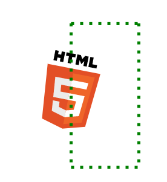

# Fabric.js简介第4部分
在前面的系列文章中，我们已经介绍了很多主题；从基本的对象操作到动画、事件、过滤器、组和子类。但还有一些非常有趣和有用的东西需要讨论！

## 自由绘画
如果说 canvas 真正的亮点是什么，那就是它对自由绘图的出色支持！由于画布仅仅是一个 2D 位图，即可以在其上绘画的纸张，因此执行自由绘画非常自然。当然，Fabric 也会为我们解决这个问题。

只需将 Fabric 画布的 `isDrawingMode` 属性设置为 true，即可启用自由绘图模式。这样，在画布上的任何进一步点击和移动都会立即被解释为铅笔/画笔。

当 `isDrawingMode` 为 true 时，您可以在画布上随意涂画。但是，只要您执行了任何移动，随后发生`mouseup`事件，Fabric 就会触发 `path:created`事件，并将刚刚绘制的形状转换为真正的 `fabric.Path` 实例！

如果您在任何时候将 `isDrawingMode` 设为 false，那么画布上将仍然存在所有已创建的路径对象。由于它们是`fabric.path`对象，因此您可以以任何方式修改它们--移动、旋转、缩放等。

还有 2 个属性可用于自定义自由绘图 - `freeDrawingBrush.color` 和 `freeDrawingBrush.width`。`freeDrawingBrush.color` 可以是任何常规颜色值，表示画笔的颜色。`freeDrawingBrush.width` 是一个像素数，表示画笔的宽度。


## 定制
Fabric 的一个神奇之处在于它的可定制性。您可以在画布或画布对象上调整数十种不同的参数，使其行为完全符合您的要求。让我们来看看其中的一些参数

### 锁定对象

画布上的每个对象都可以通过几种方式锁定。`lockMovementX`、`lockMovementY`、`lockRotation`、`lockScalingX`、`lockScalingY`是锁定相应对象动作的属性。因此，将 `object.lockMovement` 设置为 true 将阻止对象水平移动。不过您仍然可以在垂直面上移动它。同样，`lockRotation` 可以阻止旋转，而 `lockScalingX/lockScalingY` 则可以阻止缩放。所有这些都是累加的。您可以以任何方式将它们组合在一起。

### 更改边框、边角
您可以通过 `hasControls`和 `hasBorders`属性控制对象边框和边角的可见性。只需将它们设置为 false，对象就会立即 "裸露"呈现。

```javascript
object.hasBorders = false;
```


```javascript
object.hasControls = false;
```


您还可以通过调整一些自定义属性 `cornerDashArray`、`borderDashArray`、`borderColor`、`transparentCorners`、`cornerColor`、`cornerStrokeColor`、`cornerStyle`、`selectionBackgroundColor`、`padding `和 `cornerSize `来改变它们的外观。

```javascript
object.set({
  borderColor: 'red',
  cornerColor: 'green',
  cornerSize: 6
});
```

```javascript
  object.set({
    transparentCorners: false,
    cornerColor: 'blue',
    cornerStrokeColor: 'red',
    borderColor: 'red',
    cornerSize: 12,
    padding: 10,
    cornerStyle: 'circle',
    borderDashArray: [3, 3]
  });
```


### 禁用选择

通过将画布的 "selection "属性设置为 false，可以禁止在画布上选择对象。这样，画布上显示的所有内容都无法选择。如果只需要使某些对象不可选择，可以更改对象的 "selectable "属性。只要将其设置为 false，对象就会失去交互性。
### 自定义选择外观
现在，如果您不想禁用选择功能，而是想改变其外观，该怎么办？没问题。

画布上有 4 个属性可以控制其外观：`selectionColor`、`selectionBorderColor`、`selectionLineWidth `和 `selectionDashArray`。这些属性不言自明，让我们来看一个示例：
```javascript
canvas.add(new fabric.Circle({ radius: 30, fill: '#f55', top: 100, left: 100 }));

canvas.selectionColor = 'rgba(0,255,0,0.3)';
canvas.selectionBorderColor = 'red';
canvas.selectionLineWidth = 5;
```


最后一个属性 `selectionDashArray`就不那么简单了。它允许我们将选择线变成虚线。定义虚线模式的方法是通过数组指定间隔。因此，要创建一个长虚线后接一个短虚线的模式，我们可以使用 [10, 5] 这样的数组作为 `selectionDashArray`。这将绘制一条 10px 长的线，然后跳过 5px，再次绘制 10px 的线，以此类推。如果我们使用 [2, 4, 6] 数组，就会通过绘制 2px 的直线，然后跳过 4px，再绘制 6px 的直线，然后跳过 2px，再绘制 4px 的直线，然后跳过 6px，以此类推来创建图案。你就明白了。举例来说，[5, 10] 图案就是这样的：



### 虚线笔画
与画布上的 `selectionDashArray`类似，所有 Fabric 对象都有 `strokeDashArray`属性，负责对象上任何描边的虚线图案。
```javascript
var rect = new fabric.Rect({
  fill: '#06538e',
  width: 125,
  height: 125,
  stroke: 'red',
  strokeDashArray: [5, 5]
});
canvas.add(rect);
```


### 可点击区域
大家都知道，所有 Fabric 对象都有边框，当控件/边角出现时，边框用于拖动对象或旋转和缩放对象。您可能已经注意到，即使单击对象边界框内没有绘制任何内容的空间，也可以拖动对象。

请看下图：


默认情况下，画布上的所有 Fabric 对象都可以通过边界框拖动。如果您想要不同的行为--仅通过对象的实际内容点击/拖动对象，您可以在对象上使用 `perPixelTargetFind`属性。只需将其设置为true，即可。

### 旋转点

每个对象上都有一个单独的旋转控件。该控件的相应属性是 `hasRotatingPoint`。您可以通过 `rotatingPointOffset`数值属性自定义其相对于对象的偏移量。


### 对象转换

Fabric 中提供了许多与变换相关的属性。其中之一是画布实例上的 `uniScaleTransform`。该属性默认为 false，可用于启用对象的非均匀缩放；换句话说，它允许在拖动边角时改变对象的比例。


还有 `centeredScaling`（居中缩放）和 `centeredRotation`（居中旋转）属性。它们指定对象的中心是否应被用作变换的原点。

最后一对新属性是 `originX `和 `originY`。这两个属性默认设置为 `left`和 `tup`，可以通过程序更改对象的变换原点。当您拖动对象的边角时，这些属性就会在z这两个属性设置的位置下发生动态变化。

那么我们什么时候需要手动更改它们呢？例如，在处理文本对象时。动态更改文本时，文本框的尺寸会增加，`originX `和 `originY `会决定文本框的增长位置。因此，如果需要将文本对象居中，可以将 originX 设置为 `center`。如果要将其置于右侧，则需要将 `originX` 设置为 `right`。以此类推。这种行为类似于 CSS 中的 `position: absolute`。

### 画布背景和叠加

您可能还记得在第一部分中，您可以指定一种颜色来填充整个画布背景。只需将任何常规颜色值设置为画布的 `backgroundColor`属性即可。

```javascript
canvas.add(new fabric.Circle({ radius: 30, fill: '#f55', top: 100, left: 100 }));
canvas.backgroundColor = 'rgba(0,0,255,0.3)';
canvas.renderAll();
```


你还可以更进一步，指定一张图片作为背景。为此，您需要使用 `setBackgroundImage` 方法，传递 url 和完成回调选项。

```javascript
canvas.add(new fabric.Circle({ radius: 30, fill: '#f55', top: 100, left: 100 }));
canvas.setBackgroundImage('../assets/pug.jpg', canvas.renderAll.bind(canvas));
```


最后，您还可以设置覆盖图像，在这种情况下，覆盖图像将始终显示在画布上渲染的任何对象的顶部。只需使用 `setOverlayImage`，传递url 和可选的完成回调即可。
```javascript
canvas.add(new fabric.Circle({ radius: 30, fill: '#f55', top: 100, left: 100 }));
canvas.setOverlayImage('../assets/jail_cell_bars.png', canvas.renderAll.bind(canvas));
```


## Node.js 上的 Fabric
Fabric 的一个独特之处在于，它不仅可以在浏览器的客户端上运行，还可以在服务器上运行！如果您想从客户端发送数据，并在服务器上创建该数据的图像，这将非常有用。或者，如果您只是想从控制台使用 Fabric API（出于速度、便利性或其他原因），这也很有用。

让我们来看看如何设置 Node 环境并启动 Fabric。

首先，如果尚未安装 Node.js，则需要安装。根据平台的不同，有几种安装 Node 的方法。您可以按照以下说明或这些说明进行安装。

Node 安装完成后，我们需要安装 node-canvas 库。node-canvas 有专门的安装说明，具体取决于您选择的平台。

由于 Fabric 运行于 Node 之上，因此它是一个 NPM 软件包。因此，下一步就是安装 NPM。您可以在其 github repo 中找到安装说明。

最后一步是使用 NPM 安装 Fabric 软件包。只需运行 npm install fabric（或 npm install -g fabric 全局安装包）即可完成。

[上一节](./part3.md) [下一节](./part5.md)