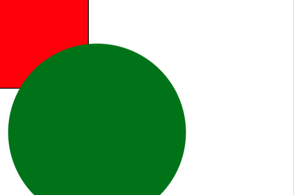
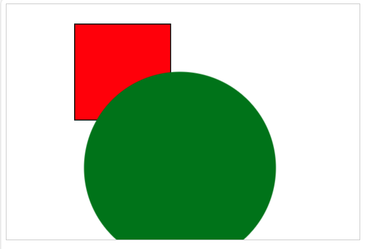

# Fabric.js简介第5部分
在前面的系列文章中，我们已经介绍了很多主题；从基本的对象操作到动画、事件、过滤器、组和子类。但还有一些非常有趣和有用的东西需要讨论！

## 缩放和平移

让我们看看如何通过鼠标交互实现缩放和平移的基本系统。我们将使用鼠标滚轮在画布上缩放至 20 倍（2000%），并使用 Alt + 单击操作进行拖动。
我们开始连接基本控件：

```html
<canvas id="c" width="600" height="400" style="border: 1px solid #ccc;"></canvas>
<script src="https://cdn.bootcdn.net/ajax/libs/fabric.js/521/fabric.js"></script>
<script>
  const fCanvas = new fabric.Canvas('c')
  const rect = new fabric.Rect({
    x: 100,
    y: 100,
    width: 200,
    height: 200,
    fill: 'red',
    stroke: 'black',
    strokeWidth: 2
  })
  fCanvas.add(rect)
  const circle = new fabric.Circle({
    radius: 200, fill: 'green', left: 20, top: 100
  })
  fCanvas.add(circle)
  fCanvas.on('mouse:wheel', function(opt) {
  var delta = opt.e.deltaY;
  var zoom = fCanvas.getZoom();
  zoom *= 0.999 ** delta;
  if (zoom > 20) zoom = 20;
  if (zoom < 0.01) zoom = 0.01;
  fCanvas.setZoom(zoom);
  opt.e.preventDefault();
  opt.e.stopPropagation();
})
</script>

```



这是一个基本的缩放控件，限制在 1% 到 2000% 之间。我们现在要添加拖动画布的功能。我们将使用 ALT + DRAG，但您也可以使用其他组合。这样做的目的是，使用 ALT 按鼠标时会将布尔值设为 true，这样鼠标移动事件就可以理解为拖动时间到了。
```html
<canvas id="c" width="600" height="400" style="border: 1px solid #ccc;"></canvas>
<script src="https://cdn.bootcdn.net/ajax/libs/fabric.js/521/fabric.js"></script>

<script>
  const fCanvas = new fabric.Canvas('c')
  const rect = new fabric.Rect({
    x: 100,
    y: 100,
    width: 200,
    height: 200,
    fill: 'red',
    stroke: 'black',
    strokeWidth: 2
  })
  fCanvas.add(rect)
  const circle = new fabric.Circle({
    radius: 200, fill: 'green', left: 20, top: 100
  })
fCanvas.add(circle)
fCanvas.on('mouse:wheel', function(opt) {
  var delta = opt.e.deltaY;
  var zoom = fCanvas.getZoom();
  zoom *= 0.999 ** delta;
  if (zoom > 20) zoom = 20;
  if (zoom < 0.01) zoom = 0.01;
  fCanvas.setZoom(zoom);
  opt.e.preventDefault();
  opt.e.stopPropagation();
})
  fCanvas.on('mouse:down', function(opt) {
  var evt = opt.e;
  if (evt.altKey === true) {
    this.isDragging = true;
    this.selection = false;
    this.lastPosX = evt.clientX;
    this.lastPosY = evt.clientY;
  }
});
fCanvas.on('mouse:move', function(opt) {
  if (this.isDragging) {
    var e = opt.e;
    var vpt = this.viewportTransform;
    vpt[4] += e.clientX - this.lastPosX;
    vpt[5] += e.clientY - this.lastPosY;
    this.requestRenderAll();
    this.lastPosX = e.clientX;
    this.lastPosY = e.clientY;
  }
});
fCanvas.on('mouse:up', function(opt) {
  this.setViewportTransform(this.viewportTransform);
  this.isDragging = false;
  this.selection = true;
});
</script>
```


好了，这是一个可以控制缩放和平移的基本设置。还有一些可能的改进。例如，我们可以让滚轮缩放使画布围绕光标所在的点居中：
```html
<canvas id="c" width="600" height="400" style="border: 1px solid #ccc;"></canvas>
<!-- 引入 Fabric.js -->
<script src="https://cdn.bootcdn.net/ajax/libs/fabric.js/521/fabric.js"></script>

<script>
  const fCanvas = new fabric.Canvas('c')
  const rect = new fabric.Rect({
    x: 100,
    y: 100,
    width: 200,
    height: 200,
    fill: 'red',
    stroke: 'black',
    strokeWidth: 2
  })
  fCanvas.add(rect)
  const circle = new fabric.Circle({
    radius: 200, fill: 'green', left: 20, top: 100
  })
fCanvas.add(circle)
fCanvas.on('mouse:wheel', function(opt) {
  var delta = opt.e.deltaY;
  var zoom = fCanvas.getZoom();
  zoom *= 0.999 ** delta;
  if (zoom > 20) zoom = 20;
  if (zoom < 0.01) zoom = 0.01;
  fCanvas.zoomToPoint({ x: opt.e.offsetX, y: opt.e.offsetY }, zoom);
  opt.e.preventDefault();
  opt.e.stopPropagation();
});
  fCanvas.on('mouse:down', function(opt) {
  var evt = opt.e;
  if (evt.altKey === true) {
    this.isDragging = true;
    this.selection = false;
    this.lastPosX = evt.clientX;
    this.lastPosY = evt.clientY;
  }
});
fCanvas.on('mouse:move', function(opt) {
  if (this.isDragging) {
    var e = opt.e;
    var vpt = this.viewportTransform;
    vpt[4] += e.clientX - this.lastPosX;
    vpt[5] += e.clientY - this.lastPosY;
    this.requestRenderAll();
    this.lastPosX = e.clientX;
    this.lastPosY = e.clientY;
  }
});
fCanvas.on('mouse:up', function(opt) {
  
  this.setViewportTransform(this.viewportTransform);
  this.isDragging = false;
  this.selection = true;
});
</script>
```
最后，我们可以限制平移区域，避免视图向一个方向无限延伸。我们划出一个 1000x1000 像素的矩形，代表我们的平移区域。然后添加代码，限制在该区域内的移动：

```html
<canvas id="c" width="400" height="400" style="border: 1px solid #ccc;"></canvas>
<!-- 引入 Fabric.js -->
<script src="https://cdn.bootcdn.net/ajax/libs/fabric.js/521/fabric.js"></script>

<script>

const fCanvas = new fabric.Canvas('c')
    
    const lineArr = []
    for (let i = 0; i < 100; i++) {
        const line = new fabric.Line([
            i * 10,
            0,
            i * 10,
            1000,
        ], {
            stroke: 'black',
            selectable: false,
            strokeWidth: .3
        })
        lineArr.push(line)
    }
    for (let i = 0; i < 100; i++) {
        const line = new fabric.Line([
            0,
            i * 10,
            1000,
            i * 10,
        ], {
            stroke: 'black',
            selectable: false,
            strokeWidth: .3
        })
        lineArr.push(line)
    }
    const backGroup = new fabric.Group(lineArr, { selectable: false });
    fCanvas.add(backGroup)
    const rect = new fabric.Rect({
        x: 100,
        y: 100,
        width: 200,
        height: 200,
        fill: 'red',
        stroke: 'black',
        strokeWidth: 2
    })
    fCanvas.add(rect)
    const circle = new fabric.Circle({
        radius: 200, fill: 'green', left: 600, top: 600
    })

    fCanvas.add(circle)
    
    fCanvas.on('mouse:down', function (opt) {
        var evt = opt.e;
            this.isDragging = true;
            this.selection = false;
            this.lastPosX = evt.clientX;
            this.lastPosY = evt.clientY;
    });
    fCanvas.on('mouse:move', function (opt) {
        if (this.isDragging) {
            var e = opt.e;
            var vpt = this.viewportTransform;
            vpt[4] += e.clientX - this.lastPosX;
            vpt[5] += e.clientY - this.lastPosY;
            this.requestRenderAll();
            this.lastPosX = e.clientX;
            this.lastPosY = e.clientY;
            var zoom = fCanvas.getZoom();
            var vpt = this.viewportTransform;
            if (zoom < 400 / 1000) {
                vpt[4] = 200 - 1000 * zoom / 2;
                vpt[5] = 200 - 1000 * zoom / 2;
            } else {
                if (vpt[4] >= 0) {
                    vpt[4] = 0;
                } else if (vpt[4] < fCanvas.getWidth() - 1000 * zoom) {
                    vpt[4] = fCanvas.getWidth() - 1000 * zoom;
                }
                if (vpt[5] >= 0) {
                    vpt[5] = 0;
                } else if (vpt[5] < fCanvas.getHeight() - 1000 * zoom) {
                    vpt[5] = fCanvas.getHeight() - 1000 * zoom;
                }
            }
        }
    });
    fCanvas.on('mouse:up', function (opt) {
        this.setViewportTransform(this.viewportTransform);
        this.isDragging = false;
        this.selection = true;
    });
</script>
```
[下一节](./part6.md)